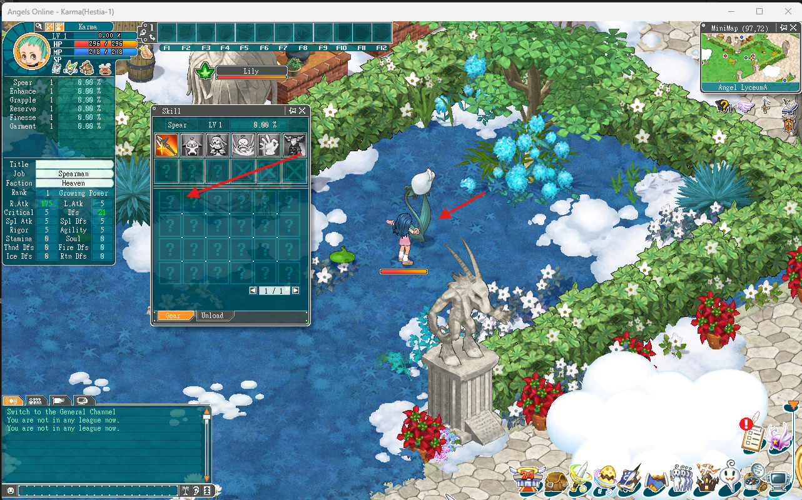
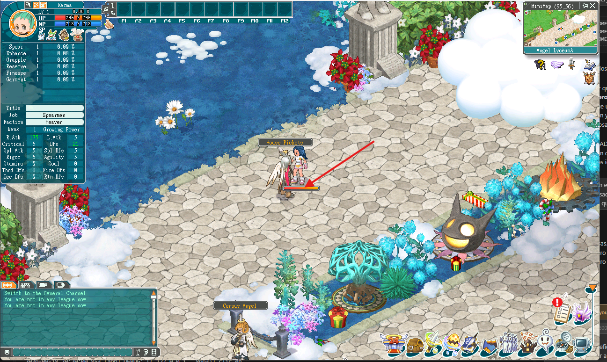
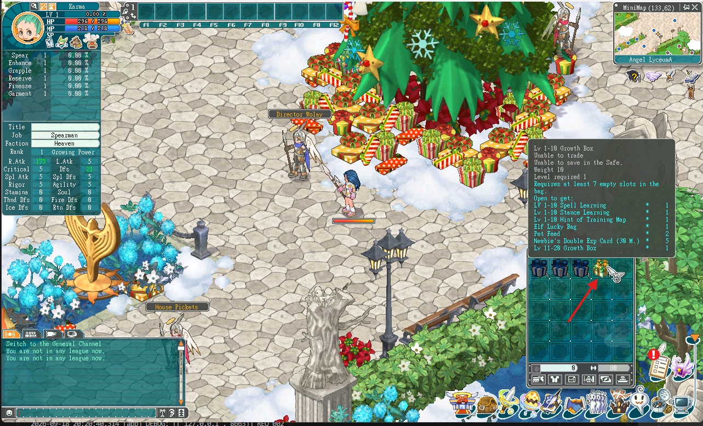
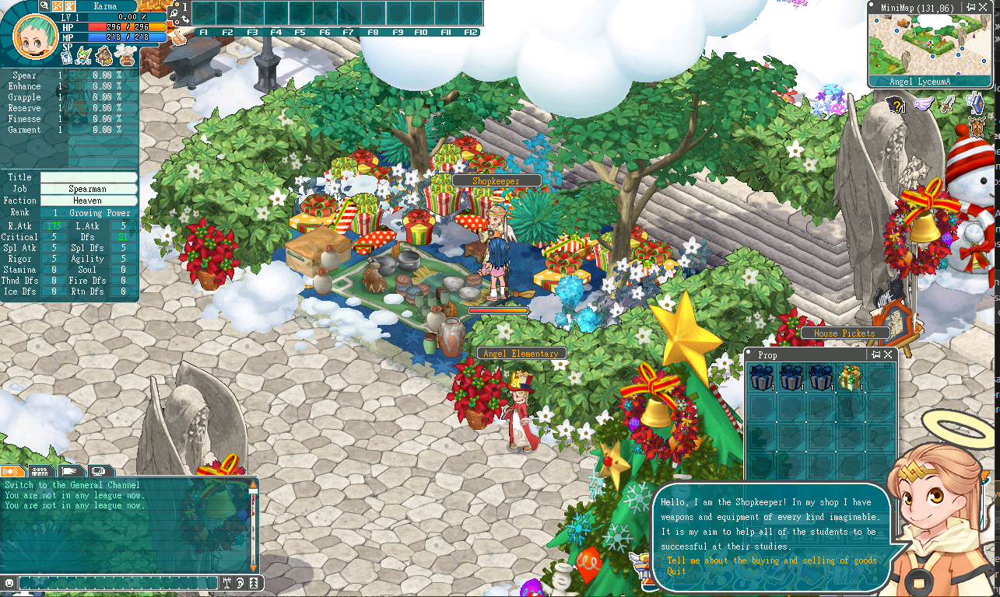
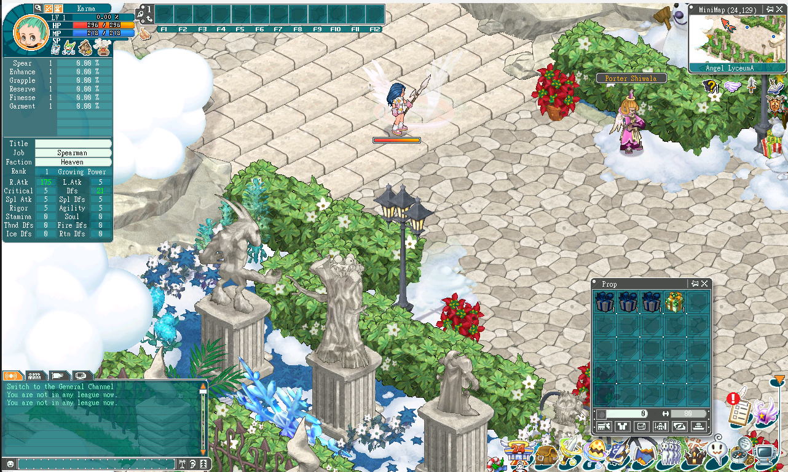

# Servidor local para Angels Online

*[English](README.md) · **Español***

Reconstrucción del protocolo de red de **Angels Online** (IGG, cerrado en
febrero de 2026, cliente 8.5.1.0) y un servidor que lo habla, hecho por ingeniería inversa del
cliente y de capturas de tráfico.

No es un emulador completo. Es el **protocolo documentado** y un servidor que
llega hasta donde llega: se crea un personaje, se hace el tutorial, se elige
clase, se pelea y se compra. Lo que falta está listado abajo, sin adornos.

---

## Estado real

**Funciona**

- Login, creación y selección de personaje, con persistencia en disco
- Entrada al mundo, movimiento y cambio de mapa
- Tutorial de Angel Raphael: elegir clase, recibir el equipo y el traslado
- Inventario completo: equipar, desequipar, mover entre casillas, durabilidad
- Stats calculados desde `item.xml` (el equipo suma de verdad)
- Angel Lyceum dibujado: 52 NPC, 81 monstruos y 158 recursos aparecen en sus
  posiciones reales, sacadas de los XML del cliente

**A medias**

- Combate: se puede fijar un objetivo y pegarle, y el servidor lleva la vida
  de cada monstruo, pero **no se ve el número de daño ni llega el botín**.
  Los mensajes se mandan y coinciden byte a byte con los del servidor real,
  así que falta algo más que todavía no se identificó
- Diálogos de NPC: 17 de los 52 NPC del Lyceum tienen su texto y sus
  opciones, pero **elegir una opción cierra el cuadro** en vez de continuar
- Tiendas: el mensaje de compra funciona y descuenta el oro, pero **la
  ventana de tienda no se abre nunca** desde el diálogo, así que jugando
  todavía no se puede comprar nada

**No funciona**

- NPC y monstruos están quietos: no se mueven, no reaccionan, no atacan por
  su cuenta y no reaparecen al morir
- Los recursos no se recolectan
- Las cajas no se abren: falta el mensaje de "usar objeto"
- Los hechizos no se lanzan: los tres iniciales aparecen en F1 a F3 pero
  usarlos no hace nada
- No hay experiencia ni subir de nivel
- No se pueden borrar personajes
- Las zonas de teletransporte del suelo no funcionan (el cambio de mapa sí,
  pero hay que dispararlo desde el servidor)
- Faltan cinco NPC del Lyceum que no se llegaron a capturar
- La contraseña **no se valida**: el bloque de autenticación no está descifrado

---

## Cómo ejecutarlo

Hace falta **Python 3.10 o superior** y el cliente de Angels Online
instalado. Probado con el cliente **8.5.1.0**; las capturas de las que sale
el protocolo se tomaron con un **8.6.0.8**, y los dos hablan lo mismo.

1. Apuntá el cliente a tu máquina. En su `server.xml`:

   ```xml
   <伺服器 名稱="Local" 編號="16" 選擇="100"
           ip="127.0.0.1" port="16768" 分流="2"
           fip="127.0.0.1" fport="21238" />
   ```

2. Arrancá el servidor:

   ```
   ./correr_servidor.sh        # Linux, macOS, Git Bash
   correr_servidor.bat         # Windows
   ```

3. Abrí el cliente y entrá con cualquier usuario. La cuenta se crea sola.

El servidor deja cada sesión grabada en `logs/sesiones/`, que es lo que se usa
para depurar.

### Variables de entorno

| Variable | Para qué sirve |
|---|---|
| `AO_TILE` | Punto de aparición en Guide Palace (por defecto `82,83`) |
| `AO_TILE_LYCEUM` | Punto de aparición en el Lyceum (`152,74`) |
| `AO_DURABILIDAD` | Multiplica la durabilidad de lo que entrega el servidor |
| `AO_SECUENCIA_COMPLETA` | Manda la captura de entrada entera, para comparar |

---

## Cómo está organizado

```
proto/        el protocolo: framing, cifrado, códec de mensajes, LZO
server/       el servidor: login, mundo, inventario, combate, diálogos
server/plantillas/   bloques medidos de tráfico real, en JSON
tools/        proxy de captura y herramientas de análisis
docs/         TODO lo que se averiguó, con cómo se verificó
```

**Leé `docs/01_HECHOS_VERIFICADOS.md` antes de tocar nada.** Son 1750 líneas
con cada hallazgo, cómo se comprobó, y los errores que se cometieron por el
camino con su diagnóstico. Esa última parte vale más que el código: varias
cosas se dieron por buenas con una sola muestra y resultaron falsas.

---

## Fallos conocidos, con foto

Cada uno está en `docs/capturas/`.

### 1. El panel de habilidades sale a medias



El panel de habilidades muestra la fila de la clase elegida y el resto en
interrogantes: el cliente no conoce las otras treinta.

Los tres hechizos iniciales **ya salen** (la captura es de antes de eso), pero
solo visualmente: están los iconos en el panel y en la barra F1 a F3, y no
hacen nada al usarlos. Falta el mensaje de lanzar un hechizo, que todavía no
está identificado. Cuáles son los tres depende del arma; se leen de
`magic.xml`, donde cada rama tiene exactamente tres registros de nivel 1 bajo
su `技能限制1` (lanza: Basic Attack I, Bloody Song I, Endless Energy I, ids
801 a 803; espada: Slicing Hit I, Swiftness Song I, Injury Cure I, 601 a 603).

### 2. Los NPC están quietos y sin diálogo



Los House Pickets y compañía se mueven solos en el juego real y tienen una
línea por defecto. Aquí están plantados y mudos: no hay movimiento de NPC, y
35 de los 52 del Lyceum no tienen ningún texto asignado.

### 3. Las cajas no se abren



Se entregan bien y el tooltip es correcto (se lee de `item.xml`), pero hacerles
clic no hace nada. Falta el mensaje de "usar objeto", que no aparece en ninguna
captura. En el juego, abrir la caja de nivel 5 entrega la de 15, esa la de 25,
y así.

### 4. La ventana de compra no se abre



El diálogo del Shopkeeper sale con sus dos opciones, pero elegir "Tell me about
the buying and selling of goods" cierra el cuadro en vez de abrir la tienda. La
compra en sí **sí funciona** (`0x0027` está implementado): lo que falta es
saber a qué diálogo lleva cada opción.

### 5. Los portales no funcionan



Las zonas de teletransporte del suelo se ven pero no hacen nada, y a veces el
personaje se queda trabado contra ellas. El cambio de mapa **sí está
implementado** (`0x000C` + `0x0009`); lo que falta es qué manda el cliente al
pisar la zona.

---

## Lo que está saltado a propósito

Para que el servidor arranque sin una base de datos ni un registro, hay cosas
que no se comprueban. No son fallos, son decisiones:

**Las cuentas se crean solas.** Entrás con cualquier usuario y queda guardado
en `data/cuentas.json`. Si querés preparar una a mano, es un JSON normal:

```json
{
  "cuentas": {
    "tuusuario": {
      "password": "loquesea",
      "personajes": []
    }
  }
}
```

**La contraseña NO se valida.** Entra cualquiera. El usuario sí se lee del
mensaje de autenticación, pero el bloque donde viaja la contraseña no está
descifrado, así que no hay con qué compararla. Se intentó dos veces dar con el
campo y las dos salieron mal: una rechazaba logins válidos y la otra aceptaba
todo porque el offset resultó ser una constante del cliente. Está documentado
en `server/cuentas.py`.

**No hay registro, ni correo, ni recuperación.** Es un servidor local.

### Fallos visuales al reconectar

Algunas cosas se ven mal hasta que salís y volvés a entrar. El servidor y el
cliente terminan de acuerdo, pero el cliente no refresca en el momento:

- Al crear un personaje, el equipo a veces no aparece hasta reconectar
- Al cambiar de mapa, la música se corta
- El panel de equipo puede quedar con una casilla dibujada de más

No corrompen nada: lo que hay en `data/cuentas.json` es siempre lo correcto.

---

## Cómo ayudar

Lo que más falta no es programación: son **capturas**.

Casi todo lo que no funciona es porque no se grabó nunca. El proxy se pone
entre el cliente y un servidor que funcione, y deja el tráfico de los dos
sentidos con marca de tiempo:

```
python tools/proxy.py --server-xml "ruta/al/server.xml"
# jugás un rato haciendo lo que se quiere capturar
python tools/proxy.py --server-xml "ruta/al/server.xml" --restaurar
python tools/correlacionar.py --novedades
```

Dos consejos que costaron varias rondas aprender:

- **Una captura solo trae lo que tuviste a la vista.** Para poblar un mapa hay
  que recorrerlo entero, no pararse en un punto.
- **Dejá un par de segundos entre acción y acción.** Si se amontonan, no hay
  forma de saber qué respuesta corresponde a qué pedido.

Lo que haría falta ahora, por orden de utilidad:

1. **Matar un monstruo entero**, desde el primer golpe hasta el botín. Acá no
   se ve el número de daño ni llega el botín, y la captura que hay no cubre el
   intercambio completo.
2. **Elegir opciones de diálogo** en varios NPC distintos. Con cinco o seis
   casos se resuelve la tienda y el punto de reaparición.
3. **Borrar un personaje** que ya haya pasado su período de protección.
4. **Cruzar una zona de teletransporte** del suelo.
5. **Recolectar un recurso** con la herramienta equipada.
6. **Subir de nivel** y ver qué manda el servidor.

### Aportes de cualquier tipo

Sirve todo, no hace falta saber de ingeniería inversa:

- **Capturas de tráfico.** Es lo que más falta. Ver arriba.
- **Código.** Los pull request son bienvenidos. Si tocás el protocolo, decí
  contra qué lo comprobaste: el proyecto se apoya en que cada afirmación tenga
  su verificación detrás.
- **Datos del cliente.** Si encontrás algo en los `.xml` o los `.pak` que acá
  se dio por imposible, decilo. Ya pasó dos veces que el dato estaba ahí.
- **Reportes de fallos.** Con el log del servidor y qué hiciste en el cliente
  alcanza. Si podés, el `logs/sesiones/` de esa partida ayuda mucho.
- **Traducciones.** La documentación está en español.
- **Probar y contar qué se rompe.** Media hora jugando encuentra cosas que no
  aparecen leyendo el código.

Si no sabés por dónde empezar, abrí un issue y preguntá.

Antes de grabar nada, mirá si el dato ya está en los XML del cliente. Pasó dos
veces: los puntos de aparición estaban en `jumpmap.xml` y los diálogos en
`msg.xml`, y se pidieron capturas para cosas que ya estaban en el disco.

---

## Créditos

Este servidor se escribió desde cero, pero no se empezó de la nada.

- **[AngelsOnlineDev/AO](https://github.com/AngelsOnlineDev/AO)** — el proyecto
  que abrió el camino. No se copió código de ahí, pero sí se estudió, y de
  mirar su log salió el hallazgo que destrabó todo el proyecto: que el
  redirect al mundo va **en respuesta al `0x0006`**, no después de la
  autenticación. Se estuvo semanas atascado en esa pantalla comparando bytes
  que ya eran correctos; el problema era el momento, no el contenido.
- **Squirrel**, de RageZone — por intentarlo antes y dejar rastro. Que alguien
  haya empezado y documentado algo, aunque no llegara al final, ahorra el
  trabajo de averiguar por dónde ni siquiera vale la pena entrar.

Y a quien haya conservado el cliente y sus `.pak`. Sin ellos no habría nada
que reconstruir: buena parte de lo que aquí funciona salió de leer los `.xml`
del propio juego, no del tráfico.

---

## Aviso

Angels Online es propiedad de IGG. Esto es trabajo de preservación de un juego
que ya no existe, hecho sobre un cliente que cualquiera puede instalar.

**No se incluye nada de IGG**: ni el cliente, ni sus datos, ni el binario
descompilado. El servidor lee los `.xml` y los `.pak` del cliente que ya tengas
instalado; sin él no funciona y no sirve de nada.

**Tampoco se incluyen capturas de tráfico.** Las que se usaron llevaban nombres
de cuenta y chat público de otras personas. El análisis está en `docs/`; los
bytes crudos no hacen falta para nada. Si aportás capturas, revisá lo mismo
antes de subirlas.
